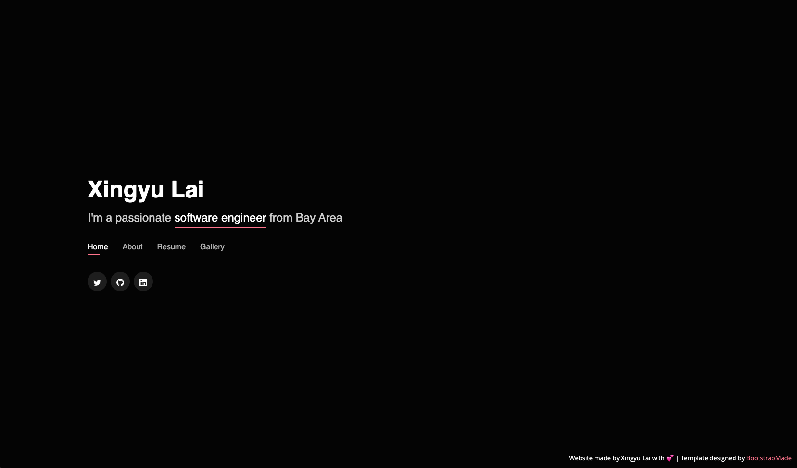
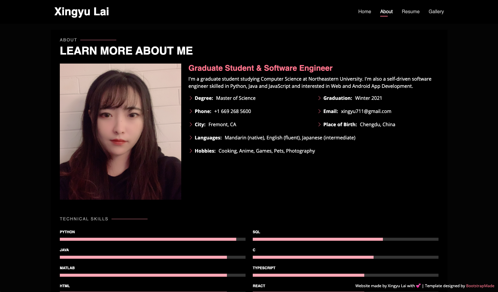
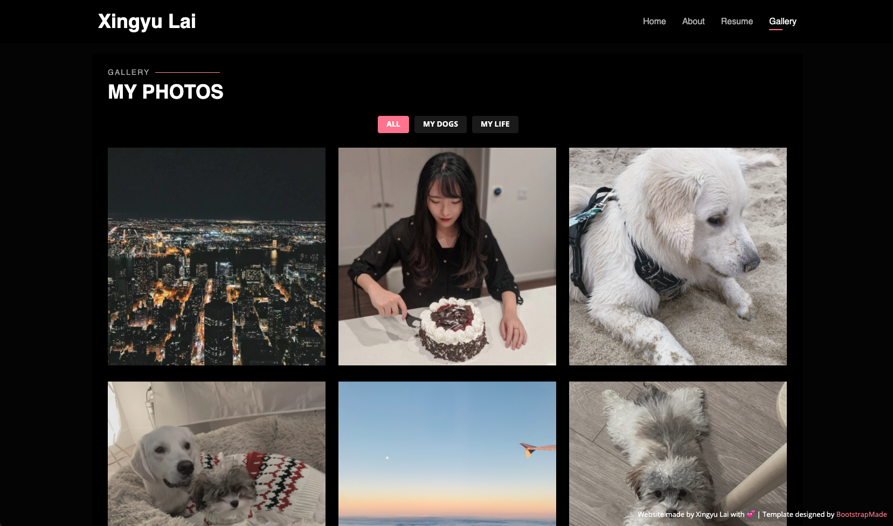

### Project Name:

Personal Homepage

### Author:

Xingyu Lai: https://xingyu711.github.io/

### Screenshot:

1. Home page with a nav bar and link to my other websites
   
2. About page with my introduction and other information like skills and coursework
   
3. Gallery page with photos of my dogs and my life
   

### Technologies used:

- HTML
- CSS
- JavaScript
- Bootstrap (Link to the template: https://bootstrapmade.com/personal-free-resume-bootstrap-template/)

### How to build the project:

1. Install node.js on your computer: https://nodejs.org/en/download/
2. Clone the repository
3. Run `npm install` in terminal to install all the dependencies
4. Run `reload -b` to start the server and open the project in browser

### Course:

- CS5610 Web Development Spring 2021
- Northeastern University
- Link to class homepage: https://johnguerra.co/classes/webDevelopment_spring_2021/

### Project Objective:

Design an interactive homepage showing skills, courses, projects, hobbies, etc.

### Project Requirements:

##### Technical Requirements:

- Writen using HTML, CSS and JavaScript
- At least one JS (Vanilla) feature not copied
- The website must have least 2 pages
- W3C Compliant: https://validator.w3.org/
- Use Bootstrap 4+ (can use template)
- Formatted using Prettier
- Validate code with esLint

##### Other requirements:

- Upload to Github
- MIT License (or equivalent)
- Deployed URL (remain online 6 months after the class ends)
- 2 min presentation Google slides
- 3 min video demonstration
- Code review
